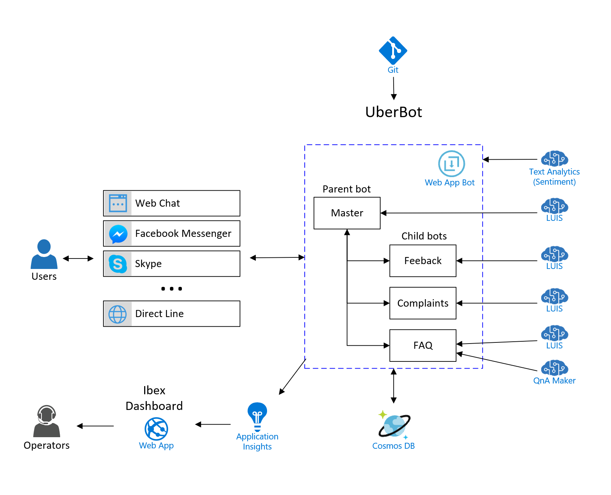

## Info:
This code is based on [Multilingual Uber-Bot](https://github.com/morsh/multilingual-uber-bot.git). Multilingual Uber-Bot is a [Microsoft Bot Framework v3](https://docs.microsoft.com/en-us/azure/bot-service/?view=azure-bot-service-3.0) example that shows how to develop a bot which provides a solution for:
- A **master bot** that can orchestrate and route into **multiple sub-bots**.
- A bot that can communicate in **multiple languages**.

I made the following changes to it:
- I refactored and migrated the NodeJS code to [TypeScript](https://www.typescriptlang.org/). TypeScript is especially helpful when defining interfaces that child bot developers must implement to interact with the master bot. This way child bots behave as plugins for the master bot.
- The bots now use [CosmosDB](https://docs.microsoft.com/en-us/azure/bot-service/nodejs/bot-builder-nodejs-state-azure-cosmosdb?view=azure-bot-service-3.0) for custom state data storage.
- Master bot now uses NLP via [LUIS](https://eu.luis.ai/) to understand user intents e.g. which child bot they want to talk to, language changes, greetings, etc.
- Each child bot uses its own LUIS when needed to understand specific user intents and entities related to its domain.
- I created a new sample FAQ child bot that leverages [QnA Maker](https://qnamaker.ai/) service.
- I instrumented master and child bots with [Microsoft Bot Builder Instrumentation](https://github.com/CatalystCode/botbuilder-instrumentation), which allows us to send all messages in and out the bot, intents recognized by LUIS, QnA Maker results, specific goals and custom events, and sentiment analysis to [Application Insights](https://azure.microsoft.com/en-us/services/application-insights/). We can then visualize all this information in custom BI dashboards with [Ibex Dashboard](https://github.com/Azure/ibex-dashboard).

## Potential improvements:
- Use [BotAuth](https://github.com/MicrosoftDX/botauth) library to authenticate users via e.g. [Facebook](https://github.com/MicrosoftDX/botauth/tree/master/Node/examples/facebook). Don't forget to add localization files for BotAuth, too. 
- Add support for Human handoff scenario with [Bot-HandOff](https://github.com/palindromed/Bot-HandOff). And gather relevant state data from the child bots to pass it to the human agents. Note that Multilingual Uber-Bot uses [Restify](http://restify.com/) web service framework while Bot-HandOff uses [Express](http://expressjs.com/). Authentication with e.g. Facebook and BotAuth fails with Express for some reason, so Bot-HandOff should be modified to use Restify, too. Also note that my code is using CosmosDB(SQL) and Bot-HandOff uses CosmosDB(MongoDB), so if we want to use a single database we should use a [MongoDBClient for the Bot Framework](https://github.com/rafadorado/BotBuilder-Azure/blob/mongodbclient/Node/src/MongoDbClient.ts).
- Use [Yeoman](http://yeoman.io/) to generate templates for child bots.

## Try the bot locally:
1. Run and debug the bot with [VSCode](https://code.visualstudio.com/) by pressing Ctrl+Shift+D and selecting "Typescript debug", or by pressing F5. Then connect the [Bot Framework Emulator](https://github.com/Microsoft/BotFramework-Emulator) to http://localhost:3977/api/messages.
2. Run the bot with "npm run-script startdev". Then connect the Bot Framework Emulator to http://localhost:3977/api/messages. Note: if you make any changes in your code, the bot will be restarted automatically.
3. Get the npm packages and compile the .ts files to .js with "npm install", and the run the bot with "npm start". Then connect the Bot Framework Emulator to http://localhost:3977/api/messages. Note: this is what Azure does when you commit your code to Git and the bot gets deployed to the Web App.

## Tips & Tricks
- To connect to the bot running locally via https, you may use [ngrok](https://ngrok.com/) tool with the command **ngrok http -host-header=localhost 3977**. This will be required if the bot authenticates users. This is also helpful if you want to expose your local bot to the Internet so you can register it with Bot Service and try it from channels like Skype, so you don't need to publish the bot